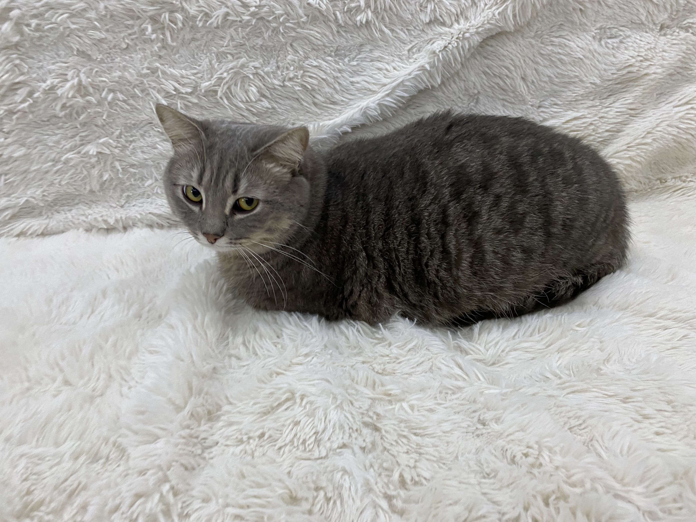
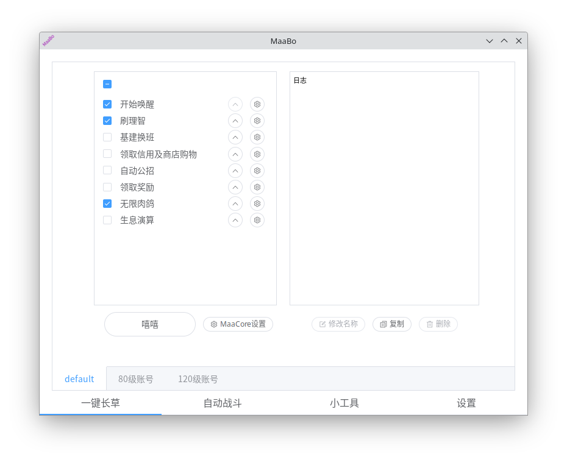
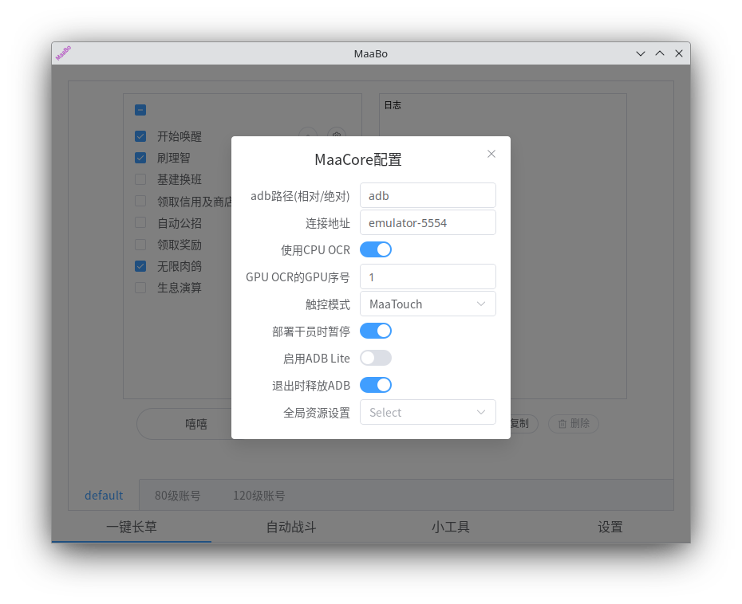
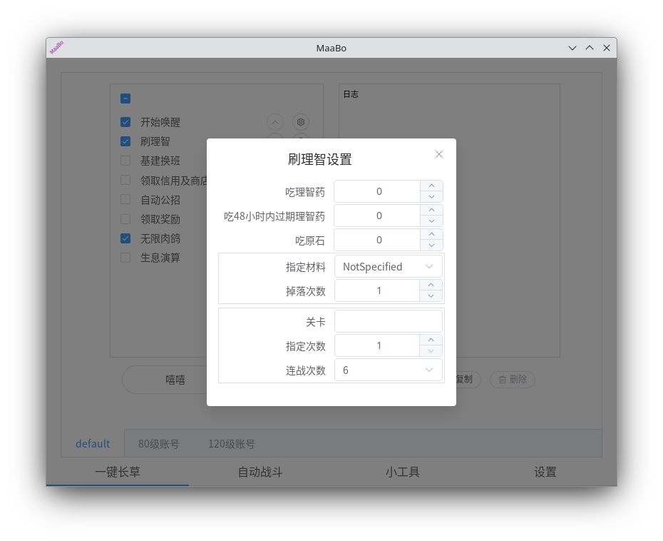
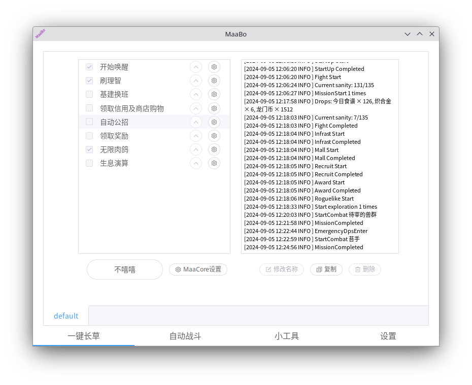
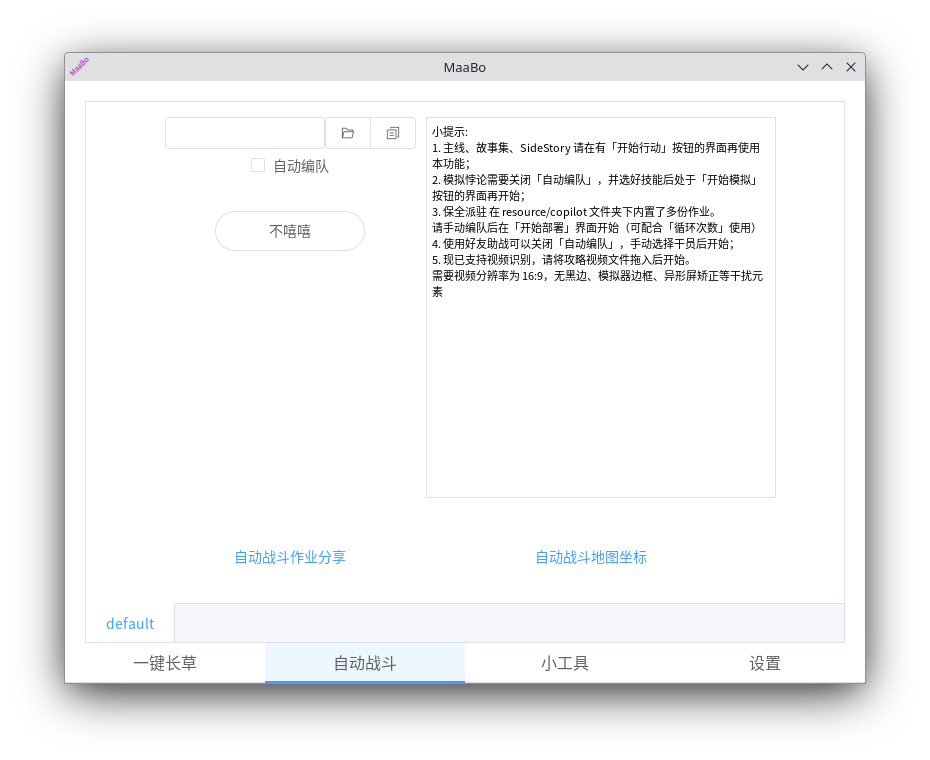

# MaaBo

> [!NOTE]
>
> - 首先该项目处于初级阶段，代码中有很多直接unwrap的没处理，所以可能会出现很多不能预测的错误
> - 不要幻想该项目可以获得比官方maa更好的体验，如果windows用户想要获得最好的体验，建议选择官方版本
> - 项目站在MaaAssistantArknights和maa-cli的巨人肩膀上实现，感谢MaaAssistantArknights和maa-cli的所有开发者付出
> - 该项目只负责显示界面、配置、显示输出，运行之类的活全都是交给maa-cli的，如果出了什么错误，请把maabo.log的内容提到issue上

## 简介

我家猫用maa的环境是`Kubuntu(x86_64)`和`OS X(x86_64)`，在非windows环境下使用有交互界面的maa有一定的难度，所以他自己复刻了一个maa。他叫啵啵，所以项目就叫MaaBo了

## 目标

- linux下的原生支持
- OS X下的原生支持
- 支持多个maa cli运行及管理

## 注意

- 受到各种限制有部分功能缺失（对比windows版的maa）
  - 刷理智->关卡，只能手动输入
  - 自动战斗->[战斗列表、追加自定干员、补充低信赖干员、循环次数]，以上都缺失配置项
  - 不支持自定义任务，是MaaBo的问题，目前不知道界面该怎么交互
  - 不支持定时任务配置，是MaaBo的问题，目前不知道界面该怎么交互
- 第一次打开释放默认配置，地址：`$HOME/.MaaBo/config`
  - 默认配置的maa-cli版本信息获取地址&下载地址是github的，所以没有科学上网可能会导致初始化失败。出现该情况请手动修改`$HOME/.MaaBo/config/cli.toml`文件下的配置项，镜像地址需要自己找
  - 请不要手动删除`$HOME/.MaaBo/config`下的`profiles/default.toml`和
    `tasks/default.toml`
  - tasks文件使用`toml`格式，一个`tasks`文件对应一个`profiles`文件，如：`tasks/default.toml`对应一个`profiles/default.toml`
- 不想用这个残缺品怎么办？
  - 删除包
  - 删除`$HOME/.MaaBo/config`

## 路线图

- [x] 自动更新
- [x] 一键种草
- [x] 自动战斗
- [x] 多配置管理
- [x] 日志
- [ ] 小工具
- [ ] MaaBo更新提醒或自动热更新
- [ ] 第三方通知
- [ ] 运行前执行命令，如：打开模拟器
- [ ] 提供web版

## 其他事项

- 使用tauri做的，所以会有web页面，改动一下应该是可以做一个通过网页控制的应用
- tauri发布2.0正式版后是可以打包安卓和ios的，不过正常应该没有这个需求
- 稳定性如何？
  - 实话实说，由于本来我技术栈不在前端和rust，所以我自己也对这个没有保障，目前阶段将就着用吧
- 为什么不发布windows包？
  - 都windows了，我建议还是用官方的比较好

## 运行截图

## 感谢

[MaaAssistantArknights](https://github.com/MaaAssistantArknights/MaaAssistantArknights) 《明日方舟》小助手，全日常一键长草！| A one-click tool for the daily tasks of Arknights, supporting all clients.

[maa-cli](https://github.com/MaaAssistantArknights/maa-cli) MAA命令行工具 | A simple CLI for MAA.
